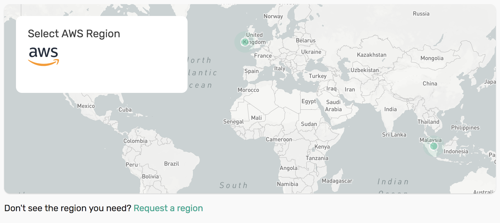
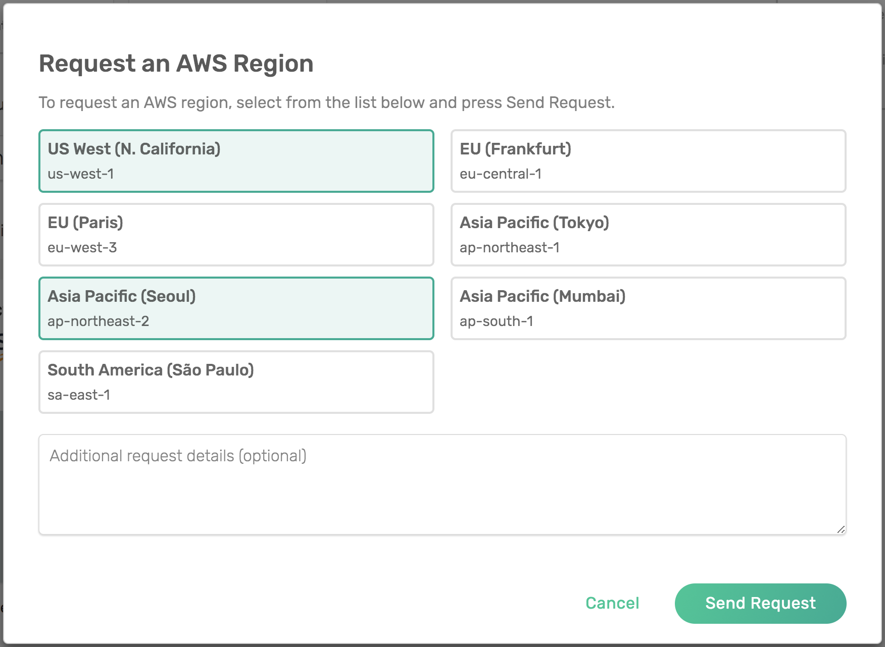

Frequently Answered Questions
=============================

Q: How do I get access to enterprise plans?

A: On the Solace Cloud `Create Service <https://console.solace.cloud/services/create>`_ page, in Step 1, select the enterprise plan you want to use. Step 2 will display a contact form. Get in touch with a Solace representative and we'll get you set up.

.. image:: ../img/faqs_enterprise_access_1.png
   :target: https://console.solace.cloud/services/create

Q: What clouds and regions are available?

A: This information is available at the bottom of our `pricing page <https://cloud.solace.com/pricing/>`_.

Q: Why aren't all of the regions listed on the `pricing page <https://cloud.solace.com/pricing/>`_ available when I'm creating a service?

A: Only certain regions are available when creating a Free service.  Free service regions are marked with an asterisk on our `pricing page <https://cloud.solace.com/pricing/>`_.  Even if you're not using a Free service, you may notice that some regions are not available.  This is because we list all of the "Available" regions on our website, while only the "Enabled" regions can be used when creating a service.

"Available" regions are those which have been identified as having the IaaS that is required to run our messaging services.  "Enabled" regions are those in which PubSub+ Cloud infrastructure is installed and ready to create messaging services.

Q: Can I request a region listed on the `pricing page <https://cloud.solace.com/pricing/>`_ to be available when I'm creating a service?

A: Yes, you can request a region from our Create Service screen.

Click the "Request a region" link under the map

Select the regions you want to request, enter any specific notes about your request and click "Send Request"

Our Operations team will contact you shortly.